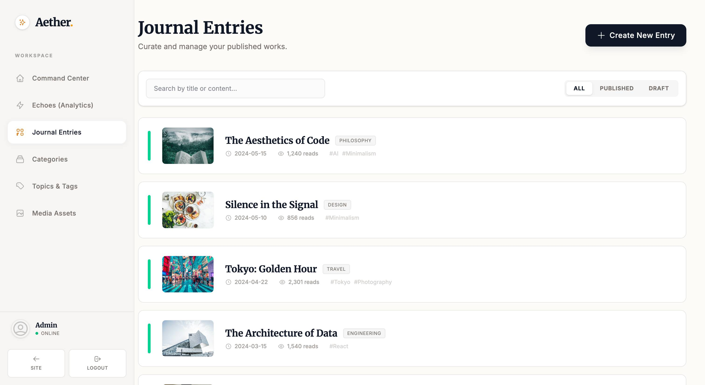

# Blog System

[中文](README_CN.md) | English

A modern blog built with Go + React + PostgreSQL. Docker-first deployment.

## Tech Stack
- Backend: Go 1.25, Gin, PostgreSQL 18, GORM, JWT
- Frontend: React 19, Vite, TailwindCSS, TypeScript

## Screenshots





---

## Quick Start
Prerequisites: Docker ≥20.10, Docker Compose ≥2.0, 2GB+ RAM.

```bash
# 1. Clone
git clone https://github.com/voocel/blog.git blog
cd blog

# 2. Init
./scripts/init.sh

# 3. Env (required)
cp .env.example .env
vim .env  # set POSTGRES_PASSWORD, JWT_SECRET; optional VITE_API_KEY

# 4. Start
docker compose up -d

# 5. Create admin
docker compose exec backend ./blog -create-admin

# 6. Visit
# http://localhost or http://your-server-ip
```

Update deploy:
```bash
git pull
docker compose up -d --build
```

### Env overview
Root `.env` (for deploy):
- `POSTGRES_PASSWORD` (required)
- `JWT_SECRET` (required, e.g. `openssl rand -base64 32`)
- `VITE_API_KEY` (optional, Gemini key for AI)

AI feature:
- Deploy: set `VITE_API_KEY` in root `.env`, then `docker compose build frontend && docker compose up -d frontend`
- Dev: set `VITE_API_KEY` in `web/.env` (optional `VITE_API_URL=http://localhost:8080/api/v1`), then `npm run dev`

Config files:
- `.env.example` (root): deploy env template
- `.env` (root): deploy env (not committed)
- `config/example.yaml`: backend template
- `config/config.yaml`: backend config (generated by init, not committed)
- `web/.env.example`: frontend dev template
- `web/.env`: frontend dev config (not committed)

Priority: `.env` > `config.yaml` > code defaults.

---

## HTTPS
Prereqs: domain points to server IP; port 80 open.

```bash
./scripts/setup-https.sh
```

Enter domains comma-separated (e.g. `example.com,www.example.com`). Script will:
1) Install acme.sh
2) Issue Let’s Encrypt cert
3) Enable Nginx HTTPS
4) Set auto-renew

Access:
- https://your-domain.com
- http://your-domain.com (redirects to HTTPS)

---

## Migration
Backup (old server):
```bash
./scripts/backup.sh
```
Includes DB, uploads/avatars, `.env`, SSL certs, GeoIP.

Restore (new server):
```bash
curl -fsSL https://get.docker.com | sh
git clone https://github.com/voocel/blog.git blog
cd blog
./scripts/init.sh
scp backup_*.tar.gz user@new-server:~/blog/
./scripts/restore.sh   # choose backup file
```

---

## Common Commands
```bash
# status
docker compose ps
# logs
docker compose logs -f
docker compose logs -f backend
docker compose logs -f nginx
# restart/stop
docker compose restart
docker compose stop
# update
git pull && docker compose up -d --build
# shell
docker compose exec backend sh
docker compose exec postgres psql -U postgres blog
# manual DB backup/restore
docker exec blog-postgres pg_dump -U postgres blog > backup.sql
docker exec -i blog-postgres psql -U postgres blog < backup.sql
```

---

## Troubleshooting
Service won’t start:
```bash
docker compose logs -f
netstat -tunlp | grep -E '80|443|8080|5432'
docker compose down
docker compose up -d --build
```

DB connection issues:
```bash
docker exec blog-postgres pg_isready -U postgres
docker exec blog-backend env | grep BLOG_
docker compose restart postgres
```

Port conflicts: edit `docker-compose.yml` ports:
```yaml
nginx:
  ports:
    - "8090:80"
    - "8443:443"
```

Cert issuance fails: ensure DNS points correctly, port 80 open, firewall allows traffic.

---

## Optional
GeoIP: download GeoLite2-City.mmdb (e.g. https://github.com/P3TERX/GeoLite.mmdb), place at `config/GeoLite2-City.mmdb`, restart backend.

Security hygiene:
1) Change default admin password
2) Strong secrets in `.env`
3) Enable HTTPS
4) Firewall (ufw allow 80/443/22; ufw enable)
5) Regular backups
6) Keep system & Docker updated

---

## Development
Backend:
```bash
go run cmd/blog/main.go
```
Frontend:
```bash
cd web
npm install
cp .env.example .env
# set VITE_API_URL=http://localhost:8080/api/v1 as needed
npm run dev
```

---

## License
Apache-2.0

